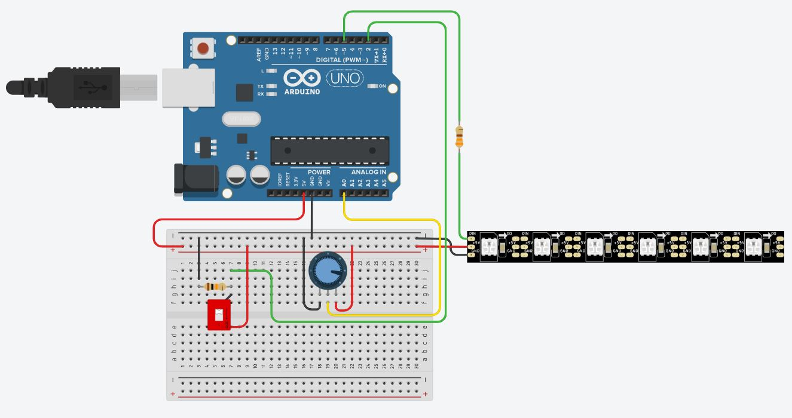

# Projeto_IoT
Utilização do software online Tinkercad.

Projeto de Fita LED com potenciômetro para controle de velocidade de acendimento e DIP SWITCH para um segundo tipo de acendimento.

<a href="projeto_iot_fitaled1.ino">Clique aqui para baixar o código ".ino"</a>
